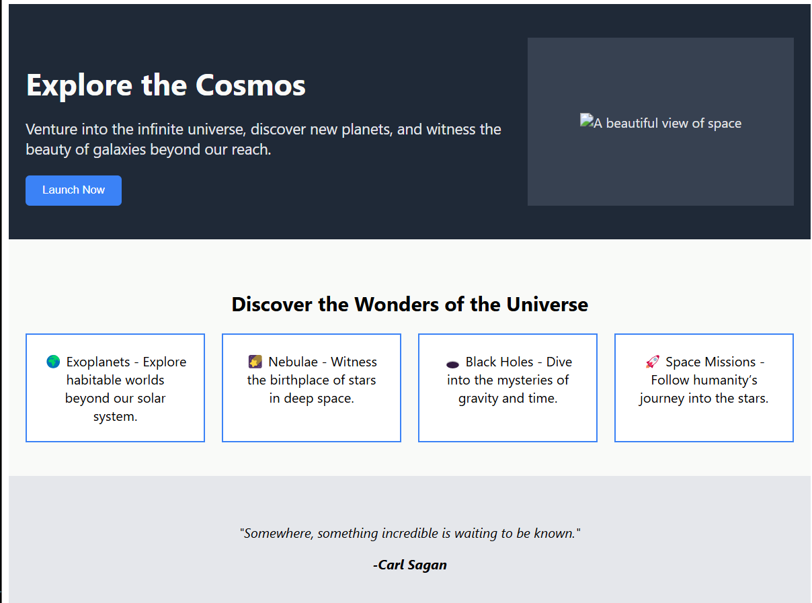

<!DOCTYPE html>
<html lang="en">
<head>
    <meta charset="UTF-8">
    <meta name="viewport" content="width=device-width, initial-scale=1.0">
    <title>README</title>
</head>
<body>
    <h1>🚀 Space-Themed Landing Page</h1>
    
A visually stunning space-themed landing page built using HTML and CSS. Explore the cosmos with a sleek design, immersive visuals, and an engaging call to action.

    <h2>🌌 Preview</h2>
    
    
Enjoy the wonders of the universe! ✨

</body>
</html>
